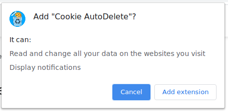
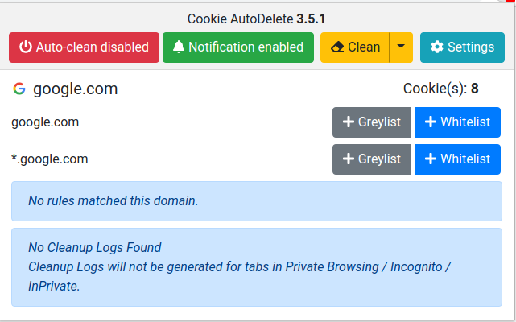

# Title #
Install a cookie manager on Chrome (and derivatives) - Cookie AutoDelete

# Summary #

Browser cookies allow websites to preserve session data such as your login credentials or items in your shopping basket
so that you don't lose information when you close the page. Unfortunately, they are often abused to track your online
activity across the web. In this guide you'll learn how to install Cookie AutoDelete, a web-browser add-on that
automatically deletes unused cookies.

# Body #

### Installation ###

Like any other add-on, install Cookie AutoDelete by visiting the [Chrome Web
Store](https://chrome.google.com/webstore/detail/cookie-autodelete/fhcgjolkccmbidfldomjliifgaodjagh) and clicking on **Add
to Chrome** (Fig. 1) and then clicking on **Add extension** when prompted (Fig. 2).

Upon successful installation you'll see the Cookie AutoDelete Welcome page (Fig. 3), and the extension icon is added to
your toolbar. When you visit a website, the Cookie AutoDelete icon shows the number of stored cookies for that website.
By clicking the icon (Fig. 4), you are able to clean cookies, and also whitelist (permanently) or greylist (until a
browser restart) websites you trust to store cookies.

The extension disables automatic cleanup by default. To enable it, click the icon (Fig. 4) and then click on
**Auto-clean disabled**. That way, you don't have to remember to manually clean your cookies: when you close a browser
tab, any cookies no longer in use are automatically deleted.
