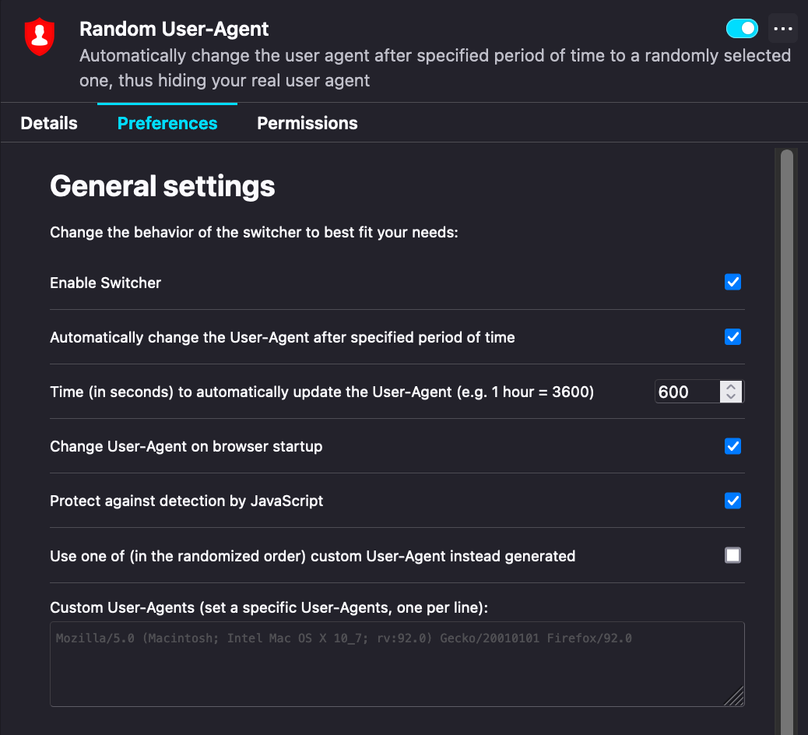

# Title  #

Install a user agent switcher on Firefox - Random User Agent

# Summary #

When you access a website, your browser sends a string called the *User Agent*. This string contains your browser's name,
operating system, and other technical metadata of your device, so that the website can respond to your request
appropriately (e.g. showing different content if you are on mobile). Unfortunately, this metadata is often used by
trackers to build a *fingerprint* of your system and being able to identify you throughout the web.

In this guide, you'll learn how to install Random User Agent on Firefox to periodically change your browser's user agent
and avoid trackers from fingerprinting you.

### Installation ###
Like any other add-on, install Random User Agent by visiting the [Mozilla Firefox Add-ons
page](https://addons.mozilla.org/en-US/firefox/addon/random_user_agent/) and clicking **Add to Firefox** (Fig. 1) and
then clicking on **Add** when prompted (Fig. 2).

Upon successful installation a notification appears on the top-right corner, and the Random User Agent icon is added to
your toolbar (Fig. 3). To check you currently assigned user-agent, click the icon (Fig. 4). Random User Agent is
configured by default to change the agent every 10 minutes, although you can configure this in settings (Fig. 5).

