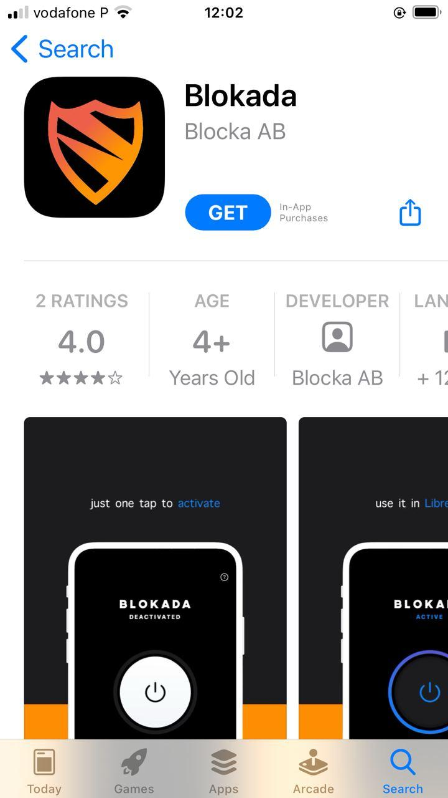
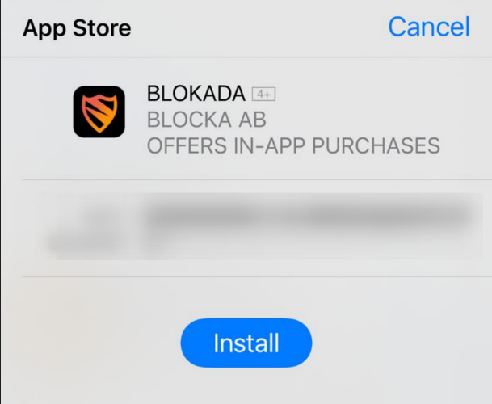
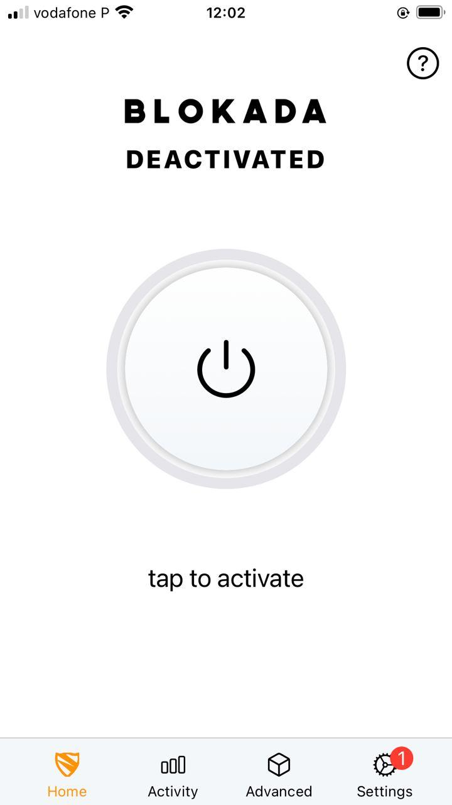
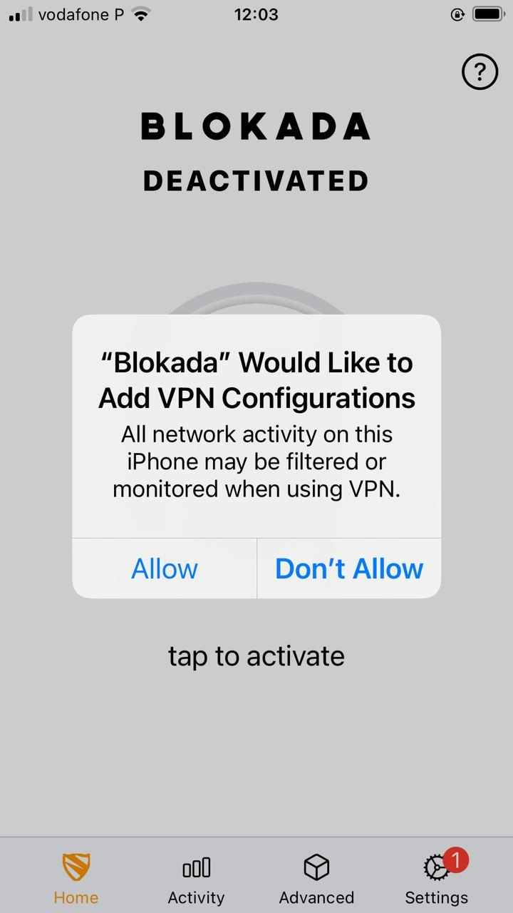
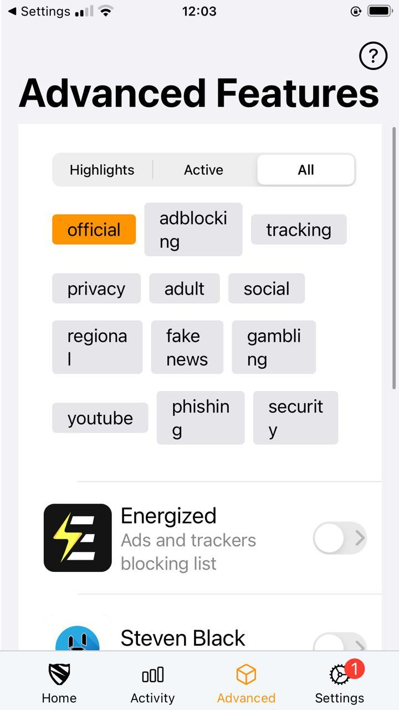

# Title #
Install an ad-blocker on iOS - Blokada

# Summary #

# Body #

### Installation ###

Install Blokada by visiting the [Apple App Store](https://apps.apple.com/us/app/blokada/id1508341781) and then click on **Get** (Fig. 1), and confirm by clicking **Install** when prompted (Fig. 2).

### Setup ###

After Blokada is installed, you can open it by clicking on the icon. By default, Blokada is disabled. To enable it, click the large button (Fig. 2).

You'll be asked to allow Blokada to setup a VPN, which is necessary for it to block ads. Blokada sets up a split-VPN,
which only routes traffic on port 53, used to communicate with external DNS resolvers. As such, Blokada **does not**
monitor or filter your regular network traffic. Click on **Allow** to proceed with the setup (Fig. 3).

Blokada should be enabled now. To select a blocking list, click on the **Advanced** tab (Fig. 4), and then select one
(or more) from the list. As in our DNS-blocking guide, we recommend you use Steven Black hosts list, as it is often
updated (the first item, Energized, was last updated on 2018).

After selecting the blocking list, your device should start blocking ads immediately. To learn more about Blokada and
its advanced features, visit its [official website](https://blokada.org/).
